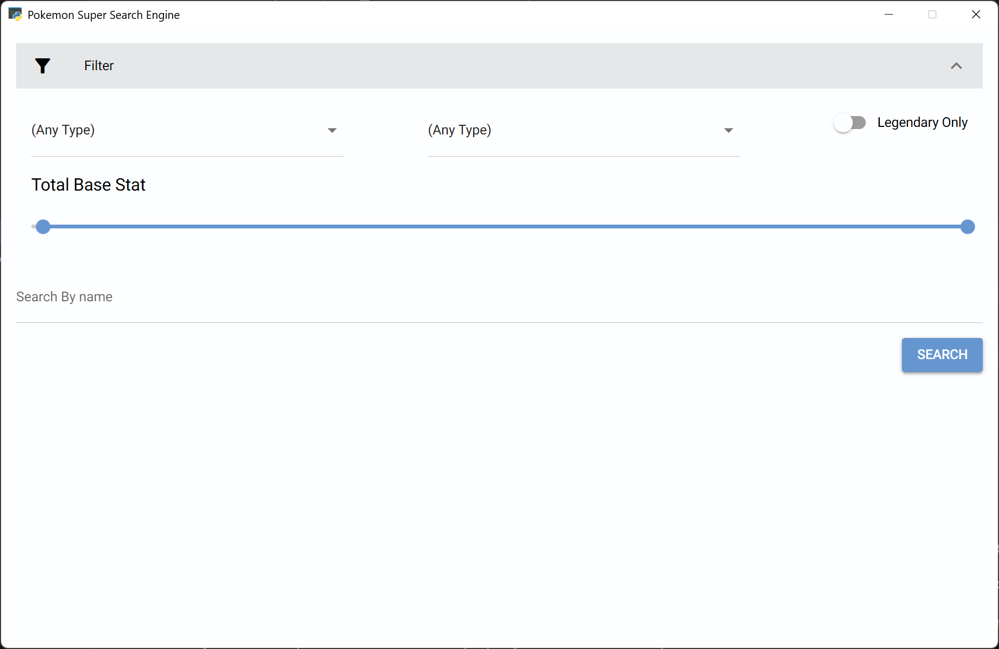
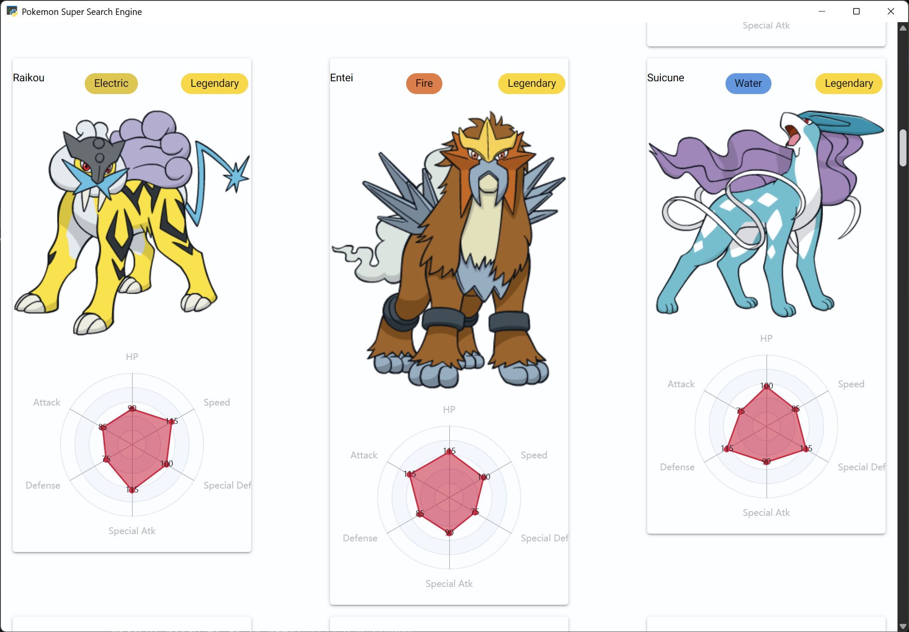
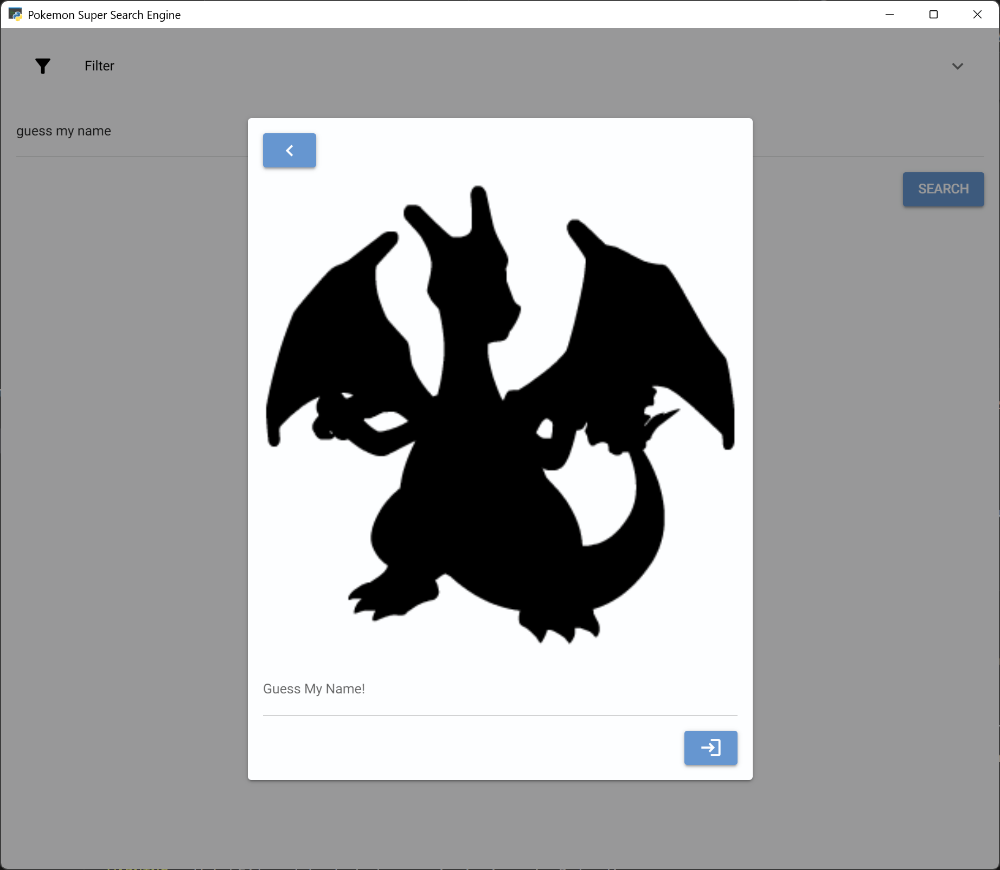
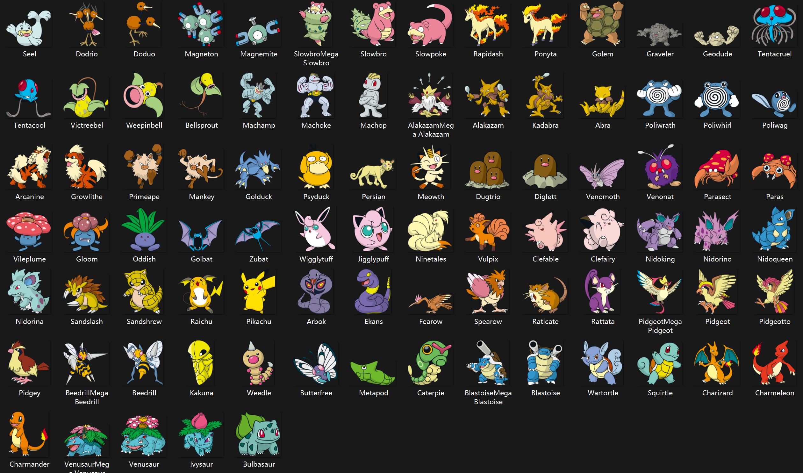

# Project Pokedex
Its a school project for H2 computing, non-graded😁
## Features



- Graphic UI
- Name Search with spelling assist
- A Robust Filter
\



- Radar graph
\



- "Guess My Name" Minigame, type "Guess My Name" in search bar to activate game
- Trolls 😏(There's a Rick and Mahoraga hidden in the pokemon data)
\



- A web scrapping script for Pokemon Pictures
\

```python
# POSSIBLE_OPTIONS=list(filter(lambda x:" " in x,NAME_LIST))
POSSIBLE_OPTIONS=["Pikachu","Eight-Handled Sword Divergent Sila Divine General Mahoraga","Charizard","Meowth","Rick Ashley"]
answer=choice(list(filter(lambda cur: cur.Name in POSSIBLE_OPTIONS,DATA)))
```
*The "Guess My name" is now on a small array for troll, You can un-comment the one above for full array

## Dependencies
- Nicegui
- Pillow
- requests
- pywebview
## [Devlog](Devlog.md)
I document my thought process and making process of this.

### Future Improvements?
**Optimisation?**
It takes **REALLY** long to start, I have no idea how 2 solve for now...\
Nicegui is a web-based gui😥, so its expected to take humongous amount of resources\
Query speed is acceptable for this data size\
maybe data loading and can be optimised.

The different "Mode" "Forms" "Mega" of the same pokemon are treated as different entities,\
Might want to merge them under one tab (But data isnt even categorised in this way...)

Async function will cause **the previous search results continue to appear even after the search ends**
Add terminations to solve (I dont have much knowledge on that yet...)

Theme, colour scheme, fonts\
Ppl are not gonna notice anyways ┌( ´_ゝ` )┐